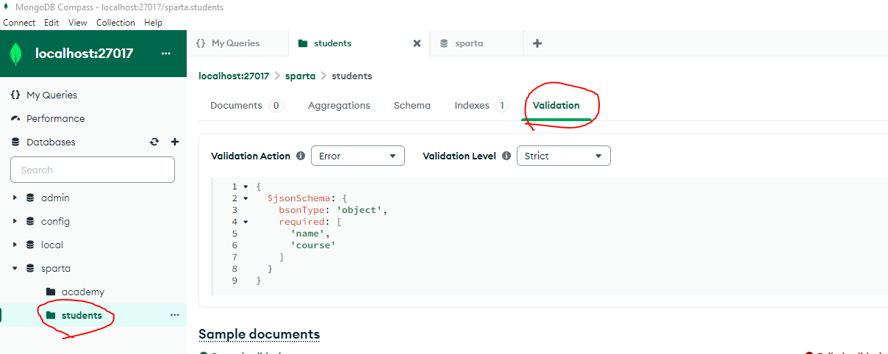

# Using MongoDB
## Basics
Install MongoDB server, shell, compass, and tools.
Ensure the mongodb server and tools bin files are added to `PATH`.

Ensure your mongodb server is running by running `mongod`.

Boot up mongo shell with `mongosh` and mongo compass.

### Creating/ Using a specific database
We can do this with the `use` command.
```
test> use sparta
switched to db sparta
sparta>
```
### Creating a collection

Now we create a collection

```
sparta> db.createCollection("academy")
< {ok: 1}
```
We can verify this in compass

### Adding entries
 We can add entries by using `insertOne` or `insertMany`
```
sparta> db.academy.insertOne({"name":"Dafydd"})
```
### Creating validation
First, let's create a new collection
```
sparta> db.creatCollection("students")
```

In compass, we can create a validation rule


and we add the code 
```
{
  $jsonSchema: {
    bsonType: 'object',
    required: [
      'name',
      'course'
    ]
  }
}
```

This makes it so all entries must have a name and course set

### Updating entries
```
sparta> db.students.insertOne({name:"Mr S. Global", year: NumberInt(2024), scor:88.2, address: {city:"Birmingham"},course:"Data"})
sparta> db.students.updateOne({name: "Mr S. Global"}, {$set: {score: 92.5, newField: true}})
```
Where the first part of the command is a filter, and the second part is what to update, changing an existing value and adding a new value

### Deleting entries
Similarly, we can delete entries with `deleteOne` or `deleteMany`, below we will delete everything by applying no filter
```
sparta> db.students.deleteMany()
< {
    acknowledge: true,
    deletedCount: 1
    }

```


## Exercises

### Exercise 1
Create a collection to store information about your favourite films. 
Add appropriate validation rules, then insert at least 3 documents. 
Practice using both .insertOne() and .insertMany(). 
You may want to type commands into a text editor then paste into the shell.

Create collection:
```
db.createCollection("films")
```
Add validation
```
{
  $jsonSchema: {
    bsonType: 'object',
    required: [
      'name',
      'year',
      'imdb_rating'
    ]
  }
}
```
This sets a validation that means that every entry must have a name, year, and imdb_rating

insertOne
```
db.films.insertOne({name: "Robocop", year: NumberInt(1987), imdb_rating: 7.6})
db.films.insertOne({name: "The Dark Knight", year: NumberInt(2008), imdb_rating: 9.0})
```
These insert one entry each into the collection

insertMany
```
db.films.insertMany([{name: "12 Angry Men", year: NumberInt(1957), imdb_rating: 9.0}, {name: "Avengers: Infinity War", year: NumberInt(2018), imdb_rating: 8.4}, {name: "Oppenheimer", year: NumberInt(2023), imdb_rating: 8.3}])
```
This does similar to the insertOne, but inserts the entries all as one command
### Exercise 2
Add a new document to the collection, add a new field to that document, remove that field and then remove the document entirely.

Add new document
```
db.films.insertOne({name: "Toy Story 3", year: NumberInt(2010), imdb_rating: 8.3})
```
Add new field that is a list of the genres
```
db.films.updateOne({name: "Toy Story 3"}, {$set:{genre:["Animation","Adventure","Comedy"]}})
```


Remove document entirely
```
db.films.deleteOne({name: "Toy Story 3"})
```
### Exercise 3
Install mongotools. Add the path to its bin folder to the PATH variable (will be inside MongoDB folder)
### Exercise 4
Download StarWars.zip. Extract it in a reasonable location. In the terminal (not mongosh) navigate to the folder, make sure it is the one that has all the json files. Then run the following command to add each to a new db called "starwars"
```
for i in *.json; do
    mongoimport --db starwars --collection characters --jsonArray --file "$i"
done
```
### Exercise 5
Write a query that finds the Luke Skywalker document
```
use starwars
db.characters.find({name:"Luke Skywalker"})
```
Make sure to be using the starwars database.
Then find all entries with name "Luke Skywalker"

Return the value of name and eye_colour only, from the "chewbacca" document
```
db.characters.find({name:"Chewbacca"},{name: 1, eye_color: 1})
```
Command runs to find all entries with name "Chewbacca" and only return the name and eye_color.

Find a way to check the species name of admiral ackbar, this is in an embedded document ("Species")
```
db.characters.find({name: "Ackbar"}, {"species.name": 1})
```
Command runs to find all entries with name "Ackbar" and only returns the species name
### Exercise 6
Write a query that gives us only the names + homeworld names of humans in the database?
```
db.characters.find({"species.name":"Human"},{name:1,"homeworld.name":1})
```
Command runs and finds all entries with species name "human" and returns only their name and homeworld name.
### Exercise 7
Write a query that gives us all the entries that have an eye_colour of either "yellow" or "orange"

```
db.characters.find({eye_color: {$in: ["yellow","orange"]}}) 
```
Command runs and find all entries which match either their eye_color being orange or yellow.

### Exercise 8
You can combine filters using $and or $or

Write a query that filter for characters that have both blue eyes and are female
```
db.characters.find({$and: [{eye_color: "blue"}, {gender: "female"}]},{name: 1, _id:0, eye_color: 1, gender: 1}) 
```

Then write a query that filters for characters that have either blue eyes or are female
```
db.characters.find({$or
: [{eye_color: "blue"}, {gender: "female"}]},{name: 1, _id:0, eye_color: 1, gender: 1})
```
### Exercise 9 
You can use comparison operators in your queries

Write a query that finds characters with a height over 200cm
```
db.characters.find({height: {$gt: 200}})
```
Command runs and find all entries with height greater than 200. It returns nothing since the height is stored as a string so cannot be compared to an integer.

Note, Height has been recorded as a string and there are some missing a height value entirely. Can you find out how to convert all the height strings to ints?
```
db.characters.aggregate([{$addFields:{height:{$toInt:"$height", onError : null, onNull: null}}}]) 
```
Command runs and aggregates through the data, adding a field called height (thus replacing the old one) as the height as an int and sets the value to null if the original height cannot be converted to an int.

I tried the above command, but it only does not update the database

We can try updating the height, but it returns errors because some heights are set to "unknown"
```
db.characters.updateMany({},{$set:{height: {$toInt: $height}}})
```
Command runs and applies to all entries, where it tries to set all heights to the integer version of their height.
Since there are some entries that cannot be converted, the command fails.

Let's try turning all "unknown" heights to null
```
db.characters.updateMany({height: "unknown"},{$set: {height: null}})
```
and then 
```
db.characters.updateMany({height: {$exists: true, $type : "string"}}, [{$set: {height: {$toInt: "$height"}}}])
```
Command runs and updates all height entries that exist (not null) and are of type string, and sets them to the integer version of the value.

Run your initial height query again to confirm your solution works.
```
db.characters.find({height: {$gt: 200}})
```


### Exercise 10

Experiment with the following operators. What does each do?
#### `$eq`
Checks for equality

Usage:
```
{ <field>: { $eq: <value> } }
```
e.g.
```
{height: {$eq: 180}}
```
returns all entries with height equal to 180
#### `$gt`
Checks if greater than value

Usage:
```
{ <field>: { $gt: <value> } }
```
e.g.
```
{height: {$gt: 180}}
```
returns all heights greater than 180
#### `$gte`
Checks if greater than or equal to

Usage:
```
{ <field>: { $gte: <value> } }
```
e.g.
```
{height: {$gte: 180}}
```
returns all heights greater than or equal to 180
#### `$in`
Checks if in array

Usage:
```
{ <field>: { $in: [<value1>, <value2>, <value3> } }
```
e.g.
```
{eye_color: {$in: ["orange","yellow"]}}
```
returns all entries with eye_color equal to orange or yellow
#### `$lt`
Checks if less than

Usage:
```
{ <field>: { $lt: <value> } }
```
e.g.
```
{height: {$lt: 180}}
```
returns all heights less than to 180
#### `$lte`
Checks if less than or equal to

Usage:
```
{ <field>: { $lte: <value> } }
```
e.g.
```
{height: {$lte: 180}}
```
returns all heights less than or equal to 180
#### `$ne`
Checks for inequality

Usage:
```
{ <field>: { $neq: <value> } }
```
e.g.
```
{height: {$neq: 180}}
```
returns all entries with height not equal to 180
#### `$nin`
Checks if not in array

Usage:
```
{ <field>: { $nin: [<value1>, <value2>, <value3> } }
```
e.g.
```
{eye_color: {$in: ["orange","yellow"]}}
```
returns all entries with eye_color not equal to orange or yellow


## Mongodb Advanced exercises

### Exercise 1

Research aggregation in Mongodb. How does it work?

Aggregation works by processing data records and returning computed results.
Aggregations can compute complex results but do not modify the original data.

Write a query that finds the total (sum) of the height of all human characters in the db
```
db.characters.aggregate([{$match:{species.name: "human"},{$group: {_id: null, totalHeight: {$sum: "$height"}}}])
```
This command aggregates through the data, filters so that only those with a species name of human are considered, and returns null id and the sum of the heights

Write a query that finds the max height per homeworld
```
db.characters.aggregate([{$group: {_id: "$homeworld.name", maximumHeight: {$max: "$height"}}}])
```
This command aggregates through the data, groups it by the homeworld name and gives the maximum height of each species.

Write a query that finds the mass and count per species. Filter out null values and sort by average mass (ascending order)

Firstly, we need to convert the mass to integers similarly to what we did to height earlier
One problem we have with this is some masses have commas in them, we need to remove these:
```
db.characters.updateMany({mass: "unknown"},{$set: {mass: null}})
db.characters.updateMany({}},[{$set:{mass:{$replaceAll:input: "$mass",find: ",",replacement: ""
db.characters.updateMany({mass: {$exists: true, $type : "string"}}, [{$set: {mass: {$toDouble: "$mass"}}}])
```


```
db.characters.aggregate([{$match: {mass: {$ne: null}}},{$group:{_id: "$species.name", totalMass: {$sum: "$mass"}, count: {$sum: 1}}},{$sort: {totalMass: 1}}])
```
### Exercise 2

Some aggregation doesn't require the .aggregate() method

Use .distinct() to find a list of all species names in the database

Use .count() or .countDocuments() to get a count of the amount of humans in the database

What does .estimatedDocumentCount({}) do?

### Exercise 3

The starwars database uses embedded documents for things like species and homeworld. Another option would be to use references.

Find the ObjectID for Darth Vader in the collection. Copy the output to your clipboard.

Create a collection in starwars called "starships"

Add Darth Vaders Tie-Fighter to that collection. Importantly we need to refernce him being the pilot. Code is below:

db.createCollection("starships")

db.starships.insertOne({
  name: "TIE Advanced x1",
  model: "Twin Ion Engine Advanced x1",
  manufacturer: "Sienar Fleet Systems",
  length: 9.2,
  max_atmosphering_speed: 1200,
  crew: 1,
  passengers: 0,
  pilot: ObjectId("5ea9890f98e05ffdb34de97e")
})

We can then use $lookup within an aggregate pipeline in order to add a field corresponding to the joined data:

db.starships.aggregate([
  { $lookup: {
    from: "characters",
    localField: "pilot",
    foreignField: "_id",
    as: "matched_pilot"
  } }
])

Now, add the Millennium Falcon to the starships collection. Look up the data or make it up. The pilot must take an array with multiple ObjectIDs though.

We could then use the same lookup as before - it works with ObjectIds in arrays too. But we'll get a huge amount of information back. To restrict it to certain fields, we could add a $project step to the pipeline, which projects certain data to the next step:

db.starships.aggregate([
  { $lookup: {
    from: "characters",
    localField: "pilot",
    foreignField: "_id",
    as: "matched_pilot"
  } },
  { $project: {name: 1, model: 1, "matched_pilot.name": 1}}
])

When first inserting documents that might have references, you can generate a new ObjectId and assign it to a variable var id = ObjectId(). That variable can then be set as the _id of the primary document and as the reference for the referencing document.

### Exercise 4

Well done! You have completed our Mongodb exercises!

Feel free to play with Mongo more, explore the documentation and try out new things!

You may want to use the starwars database or find a new one to work with.
